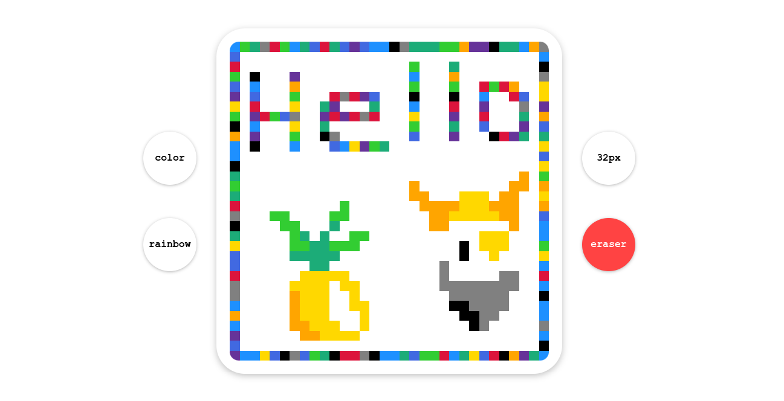

# Pixel Sketch
## Live Preview <a href="https://anaseig.github.io/pixel_sketch" target="_blank">HERE</a>

This has been the most challanging project I've done so far. Especially the javascript part was the most time consuming. So I learned a lot from this; most importantly breaking down big problems into smaller pieces and going through it.

Sure this experience would me a lot on my future projects, but without the help of other coders on TheOdinProject discord community I wouldn't have finished it. I am deeply grateful for each and every person for helping me.

It started this project on <b>29 August</b>, and finished it on <b>19 September</b>.

I procastinated a lot, but when it comes to actual coding and researching it took me around <b>12-14 HOURS</b> to fully finish this.

